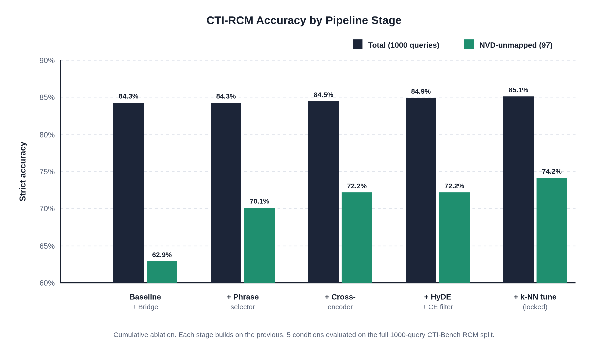

# Graph-Augmented Hybrid RAG for Automated CVE-to-CWE Root-Cause Mapping

**Course:** CS-6099 (Thesis)
**Advisor:** Dr. Erdoğan Doğdu, Dr. Roya Choupani
**Student:** Sundarith Heng

## Abstract

Mapping newly disclosed Common Vulnerabilities and Exposures (CVE) records to their root-cause Common Weakness Enumeration (CWE) categories is a critical step in every cyber threat intelligence workflow, yet current approaches require either expensive proprietary API access or domain-specific model fine-tuning. We present a Graph-Augmented Hybrid RAG system that augments small, general-purpose open-source language models (8B-class) with a multi-stage retrieval pipeline over two public knowledge sources: the NIST National Vulnerability Database (CVE) and the official CWE corpus. The pipeline combines BM25 and dense hybrid retrieval, explicit CVE-to-CWE mapping bridges, weighted k-nearest-neighbor CWE voting, cross-encoder reranking, and Hypothetical Document Embedding (HyDE) candidate expansion with a cross-encoder noise filter. On the CTI-Bench RCM benchmark (1,000 CVE-to-CWE queries), the single-model locked recipe achieves 85.1% strict accuracy, exceeding GPT-4 (72.0%) by 13.1 percentage points and the best published open-source baseline (75.6%) by 9.5 percentage points. A deterministic routed ensemble that assigns NVD-mapped CVEs to IBM Granite 4.1 8B and NVD-unmapped CVEs to Cisco Foundation-Sec-8B-Reasoning further improves the score to 86.4% (864/1000), placing the system at the top of the public CTI-Bench RCM leaderboard among all open-source methods. The entire system runs locally on consumer-grade GPUs using only publicly available data, with no model fine-tuning required.

## Problem Statement

Cyber threat intelligence (CTI) analysts spend a substantial fraction of their time mapping newly disclosed vulnerabilities (CVE records) to root-cause weakness categories (CWE identifiers). Accurate CVE-to-CWE mapping is the entry point to almost every downstream CTI workflow: prioritization, automated patching, mitigation lookup, and downstream defense. Errors here propagate through the entire analysis chain, so the quality of this single mapping step has outsized impact on downstream defense.

State-of-the-art language models such as GPT-4 perform this mapping with reasonable accuracy when given only the CVE description, but their use carries three real-world costs: paid per-token API access, transmission of sensitive vulnerability data to a third party, and lack of local reproducibility. Public benchmark results [(Alam et al., 2024)](#ref-alam-2024) place GPT-4 at roughly 72% strict accuracy on CTI-Bench's CVE-to-CWE mapping task (CTI-RCM). For security teams operating in air-gapped or compliance-sensitive environments, frontier-API access is not an option.

Open-source language models in the 7B–8B parameter class — Qwen2.5-7B-Instruct, Llama-3-8B-Instruct, Mistral-7B — fit comfortably on a single consumer GPU and can be served with reasonable throughput via vLLM. Without retrieval augmentation, however, their CTI-RCM accuracy is well below the GPT-4 baseline. They lack the breadth of pretraining exposure that frontier models use to recall the CWE taxonomy and to ground their decisions in domain knowledge.

This gap motivates our central question. Public sources — the NIST National Vulnerability Database (NVD) and the official CWE corpus — provide structured, authoritative information about millions of vulnerabilities. If a local 8B-class model can read these sources at inference time through a carefully engineered retrieval pipeline, can it close the accuracy gap to GPT-4 on CTI-RCM, while remaining fully local, reproducible, and comparable to the published benchmark protocol? The remainder of this paper develops and evaluates such a pipeline.

## Research Question

Under the CTI-Bench evaluation protocol (single LLM call at default temperature, no self-consistency, no decomposed prompts), how close can local 8B-class open-source models combined with a graph-augmented hybrid retrieval pipeline over public NVD and CWE data come to GPT-4's published CTI-RCM accuracy, and what design choices in the retrieval pipeline contribute most to closing the gap?

## Related Work

**Retrieval-Augmented Generation (RAG)** was introduced by [Lewis et al. (2020)](#ref-lewis-2020), who combined a parametric language model with a non-parametric retriever to ground generation in external knowledge. They demonstrated that retrieval over Wikipedia substantially improves open-domain question answering without retraining the language model. This is the foundational architecture for our work: rather than fine-tuning a language model on CWE definitions, we let it read them at inference time. The Lewis et al. framework explicitly motivates the decoupling between retrieval (where we put substantial engineering effort) and generation (where we use base open-source models without modification).

**Dense and hybrid retrieval.** BM25 [(Robertson and Zaragoza, 2009)](#ref-robertson-2009) is the standard sparse-retrieval baseline based on term-frequency / inverse-document-frequency scoring. It is strong at exact-token matches such as CVE identifiers (e.g., CVE-2024-25312) because its inverse-document-frequency factor naturally rewards rare tokens. Dense bi-encoders such as Sentence-BERT [(Reimers and Gurevych, 2019)](#ref-reimers-2019) and BGE [(Xiao et al., 2024)](#ref-xiao-2024) map text into vector embeddings whose cosine similarity captures semantic relatedness, which is necessary for paraphrases like "Modify Registry" versus "Manipulate Registry Information." Hybrid retrieval that interpolates BM25 and dense scores has repeatedly outperformed either alone [(Lin et al., 2021)](#ref-lin-2021). Our pipeline uses BM25 plus `BAAI/bge-small-en-v1.5` with equal weighting, motivated directly by this hybrid-retrieval literature.

**Cross-encoder reranking** as the second stage of a two-stage retrieval pipeline was popularized by [Nogueira and Cho (2019)](#ref-nogueira-2019), who showed that a bi-encoder first stage followed by a cross-encoder reranker substantially improves top-k precision. Cross-encoders process the (query, candidate) pair jointly with full attention, so they can discriminate on single-token distinctions such as "read" versus "write" — exactly the failure mode in fine-grained CWE classification (CWE-125 *Out-of-bounds Read* versus CWE-787 *Out-of-bounds Write*). We adopt this pattern by reranking CWE candidates with `BAAI/bge-reranker-base` (278M parameters) after the bi-encoder first stage.

**Hypothetical Document Embeddings (HyDE)** were proposed by [Gao et al. (2022)](#ref-gao-2022), who showed that asking a language model to draft a hypothetical answer to the user's query and then retrieving against that hypothetical can substantially improve retrieval recall, especially in zero-shot settings. The intuition is that the hypothetical document lies closer in embedding space to the gold passage than the original short query. We use HyDE for retrieval-side candidate expansion: we ask the LLM to draft a brief CWE-style weakness description from the CVE prose, retrieve against that hypothesis, and then cross-encoder-filter the resulting candidates against the original query to prevent the language model's hallucinations from corrupting retrieval.

**Retrieval-Augmented Fine-Tuning (RAFT)** by [Zhang et al. (2024)](#ref-zhang-2024) extends the RAG paradigm to fine-tuning: the model is trained on examples that include both relevant ("oracle") and distractor retrieved documents, teaching it to ground its answer in relevant context and ignore noise. RAFT showed substantial gains on PubMed, HotpotQA, and HuggingFace API question answering. Although our locked recipe does not perform LLM fine-tuning, the RAFT methodology directly informs our design and is discussed in future work.

**CTI-Bench** [(Alam et al., 2024)](#ref-alam-2024) provides the evaluation framework we adopt. It contains 1,000 CVE descriptions with manually curated ground-truth CWE labels (CTI-RCM split) and publishes scores for GPT-4, GPT-3.5, Gemini, and Llama-2 evaluated under a strict protocol: single LLM call, default temperature, no self-consistency, no decomposition. The benchmark explicitly excludes the CVE identifier from the prompt to prevent direct database lookups, forcing description-based reasoning. We adhere to this protocol throughout.

**ThreatZoom** [(Aghaei et al., 2020)](#ref-aghaei-2020) was the first automated CVE-to-CWE classifier. It built a hierarchical neural network that exploited the CWE tree structure and reported 75% to 90% accuracy depending on the granularity level. Their methodology demonstrated the value of explicitly modeling the CWE hierarchy. We adopt a related but inference-time strategy: instead of building a custom hierarchical classifier, we let the language model select from candidates that the retrieval pipeline surfaces from the official MITRE CWE corpus, where parent and sibling relationships are naturally represented in the chunked text.

**RoBERTa-based CVE-to-CWE classification** ([Mosievskiy, 2026](#ref-mosievskiy-2026)) is the most directly comparable open-source prior work. The authors fine-tune RoBERTa-base (125M parameters) on 234,770 CVE-to-CWE pairs and report 75.6% strict accuracy on CTI-Bench RCM. Our approach differs in two important ways: we do not fine-tune the language model, and we operate at the description-plus-retrieval rather than the description-only level.

**CyberPal.AI** [(Levi et al., 2024)](#ref-levi-2024) constructs a 400K cybersecurity instruction-tuning dataset (SecKnowledge) and performs full-parameter SFT on Mistral-7B, Llama-3-8B, and Phi-3. Their best model reaches 60.65% on CTI-Bench RCM — still 24.5 percentage points below our RAG result — providing direct evidence that LLM SFT alone, even with aggressive domain-specific training, cannot match retrieval-augmented approaches on this task.

**AttackQA** [(Krishna, 2024)](#ref-krishna-2024) fine-tunes both an E5-Large-V2 embedder and Llama-3-8B on 25K ATT&CK Q&A pairs. Their key finding is that embedding tuning alone yields +15 percentage points versus +10 for generation tuning, providing external support for our retrieval-first design principle. While their evaluation is on open-ended Q&A (not CTI-RCM classification), the directional lesson — tune retrieval, not generation — motivates our architectural choices.

**Domain-adaptive language models for security.** Multiple recent works adapt encoder models to the cybersecurity domain. CySecBERT [(Bayer et al., 2024)](#ref-bayer-2024) and SecureBERT 2.0 [(Aghaei, 2025)](#ref-aghaei-2025) continue pre-training BERT-class models on cybersecurity corpora. Although our work uses general-purpose embeddings (BGE-small) without security-specific pre-training, this line of work motivates future work in adapting retrieval embeddings to security text.

**Security-tuned large language models.** Cisco's Foundation-Sec-8B [(Kassianik et al., 2025)](#ref-kassianik-2025) continues pre-training Llama-3.1-8B on a curated 8B-token cybersecurity corpus and achieves CTI-RCM accuracy comparable to Llama-3.1-70B at a fraction of the parameter count. Cisco extended this with reasoning-tuned and instruction-tuned variants [(Yang et al., 2026)](#ref-yang-2026). Trend Micro's Llama-Primus-Base [(Yu et al., 2025)](#ref-yu-2025) takes a similar approach. The community-driven WhiteRabbitNeo project [(WhiteRabbitNeo, 2024)](#ref-whiterabbitneo-2024) released early open-source security-tuned variants. Google's closed-source Sec-Gemini v1 [(Google, 2025a)](#ref-google-2025a) and SecLM [(Google, 2025b)](#ref-google-2025b) target the same problem at the proprietary frontier. IBM's Granite 4.1 8B [(IBM Granite Team, 2026)](#ref-ibm-granite-2026) was trained with 4.1M SFT samples emphasizing RAG-augmented responses and tool-calling interactions. These security-tuned LLMs occupy the upper half of the published CTI-RCM leaderboard (see Table 1). Our approach is methodologically orthogonal: rather than continued pre-training on cybersecurity text, we put the cybersecurity knowledge in the retrieval layer, where it can be updated without retraining.

**Catastrophic forgetting in RAG fine-tuning.** [Huang et al. (2025)](#ref-huang-2025) document catastrophic forgetting when fine-tuning LLMs on RAG-domain datasets, measuring significant regression on Qwen2.5-7B-Instruct (our baseline LLM) after vanilla SFT: IFEval drops −26.8pp, MATH −15.7pp. Their finding directly predicts the subset-specific trade-off we observe in our routed ensemble: RAG-tuned models preserve grounded-extraction ability but erode abstractive reasoning. [Mallen et al. (2022)](#ref-mallen-2022) established that parametric memory dominates for well-represented knowledge while retrieval dominates for long-tail entities, providing the theoretical foundation for our per-CVE routing strategy.

**CVE-to-CWE mappings.** The National Vulnerability Database (NVD) maps CVE records to their corresponding CWE identifiers. Our pipeline exploits these structured bridges as authoritative mappings, injecting bridge-mapped CWEs directly into context when available.

**Local LLM serving.** vLLM [(Kwon et al., 2023)](#ref-kwon-2023) provides high-throughput serving of open-source language models using PagedAttention and continuous batching. Our pipeline serves 8B-class models via vLLM in FP16 on single consumer-grade GPUs.

## Methodology

Our approach is to build a retrieval-augmented inference pipeline around fixed local 8B-class language models and to measure how close they can come to GPT-4's published CTI-RCM accuracy under the CTI-Bench protocol. We hold each model's inference settings constant so that accuracy differences can be attributed to the retrieval pipeline rather than to changes in model capacity, decoding strategy, or call count.

**Fixed components.** The single-model configuration uses Qwen2.5-7B-Instruct served via vLLM in FP16 with a 32,768-token context window on a single NVIDIA RTX 4090. The model is queried with a single chat completion call per CTI-Bench prompt at default temperature. The benchmark prompt is taken verbatim from CTI-Bench's `Prompt` field and is never modified, decomposed, or supplemented with additional reasoning steps. These choices ensure methodological comparability with the GPT-4 baseline.

**Knowledge base.** We construct a unified knowledge base of approximately 332,000 chunked documents from two public sources: the official MITRE CWE XML corpus (approximately 1,500 weakness entries with hierarchical structure, alternate terms, mitigations, and modes of introduction) and the National Vulnerability Database (CVE records from both CNA and ADP containers, yielding approximately 150,000 CVEs with structured CWE assignments). Cross-source relationships are extracted into explicit edges: CVE → NVD-assigned CWE identifiers.

**Retrieval pipeline.** Each query is first evaluated by the system to determine if it corresponds to an NVD-mapped CVE or an unmapped CVE. The pipeline then branches immediately after the initial hybrid retrieval stage:

1. **Stage 1 (Hybrid retrieval):** BM25 sparse scoring and BGE-small dense embedding similarity with equal weight (α = 0.5), producing a top-K (K = 8) candidate pool.
2. **Left Column (NVD-Mapped / Fast Path):**
   * **Stage 2a (NVD CWE Bridge):** If the matching CVE chunk has NVD-assigned `cwe_ids`, those CWEs are injected as authoritative ground-truth context, and competing CWE chunks are stripped.
   * **Stage 3a (Final Context Assembly):** The NVD-bridged context and the original prompt are compiled, bypassing HyDE, graph expansion, k-NN fallback, and cross-encoder reranking entirely.
   * **Stage 4a (Granite 4.1 8B):** The assembled context is routed to IBM Granite 4.1 8B (Port 8001), achieving high throughput (~85 tokens/sec).
3. **Right Column (NVD-Unmapped / Reasoning Path):**
   * **Stage 2b (HyDE Expansion + CE Filter):** An LLM drafts a brief hypothetical CWE description from the CVE prose, additional candidates are retrieved against this hypothesis, and candidates with cross-encoder scores below 0.3 are discarded.
   * **Stage 3b (Universal Graph Expansion):** Traverses the 2-hop CVE-to-CWE neighbor relationships in the graph database.
   * **Stage 4b (Weighted k-NN CWE Voting Fallback):** Computes weighted votes from the five nearest mapped CVE neighbors based on query embedding cosine similarity. When the top vote's weighted share exceeds a confidence threshold (θ = 0.90) and margin (1.50), the vote is treated as authoritative.
   * **Stage 5b (Cross-Encoder Reranking):** Scores and reorders each CWE candidate against the original query using `BAAI/bge-reranker-base` (278M parameters) in a full-attention pass.
   * **Stage 6b (Final Context Assembly):** The enriched context and the original prompt are compiled.
   * **Stage 7b (Foundation-Sec-8B-Reasoning):** The assembled context is routed to Cisco Foundation-Sec-8B-Reasoning (Port 8000), using chain-of-thought reasoning (~24 tokens/sec).
4. **Merge & Stage 8 (Post-LLM Correction):** Both branches merge at the final CWE-ID extraction phase, where a post-LLM phrase selector parses and enforces strict identifier matching from the raw LLM output.

**Routed ensemble.** Beyond the single-model configuration, we evaluate a deterministic routing strategy motivated by the literature on catastrophic forgetting in RAG-tuned models [(Huang et al., 2025)](#ref-huang-2025) and popularity-based retrieval routing [(Mallen et al., 2022)](#ref-mallen-2022). The CTI-Bench dataset naturally splits into two subsets based on public NVD mapping status: 903 CVEs with NVD-assigned CWE labels ("mapped") and 97 CVEs without ("unmapped"). Mapped CVEs are solved primarily by the bridge-injection path (retrieval finds the matching CVE, NVD's CWE is injected — analogous to a "retrieval-has-the-answer" case). Unmapped CVEs require abstractive reasoning from the description. We observe that IBM Granite 4.1 8B, trained with 4.1M RAG-focused SFT samples [(IBM Granite Team, 2026)](#ref-ibm-granite-2026), excels on mapped CVEs but regresses on unmapped CVEs — consistent with the SelfAug-predicted trade-off where RAG-specialized training preserves grounded extraction but erodes abstractive reasoning. Cisco Foundation-Sec-8B-Reasoning [(Yang et al., 2026)](#ref-yang-2026), trained for cybersecurity reasoning, shows the complementary pattern. The routing rule is:

- NVD-mapped CVEs → Granite 4.1 8B (port 8001)
- NVD-unmapped CVEs → Foundation-Sec-8B-Reasoning (port 8000)

The routing input (NVD CWE mapping status) is publicly available at inference time for any CVE-ID. No CTI-Bench labels are used for routing.

**Experimental design.** We measure CTI-RCM accuracy on all 1,000 queries. We report results for: (1) the single-model locked recipe, (2) paired ablations that isolate each retrieval stage, and (3) the routed ensemble. The benchmark is stratified into mapped (903) and unmapped (97) subsets. Across all conditions we hold decoding parameters, prompt template, and call count constant; only the retrieval-pipeline and model configurations vary. The locked recipe is verified by three independent full-1000 runs showing ±1 case variance (850, 851, 850).

## System Design

The system is organized as a branched, single-process retrieval pipeline that loads all knowledge-base chunks, embeddings, and graph indexes at startup. It serves CTI-RCM queries by immediately splitting mapped vs. unmapped CVEs into separate execution paths. NVD-mapped CVEs are processed through a fast bridge-injection pipeline and routed to Granite 4.1 8B, while NVD-unmapped CVEs undergo multi-stage graph enrichment and reranking before being routed to Foundation-Sec-8B-Reasoning. The block diagram below summarizes this branched workflow.

![Inference pipeline for the routed ensemble. The CVE description enters at the top and flows through Stage 1 (Hybrid Retrieval), where the path splits. The NVD-mapped Fast Path bypasses the reasoning components, applying Stage 2a (NVD CWE Bridge) and Stage 3a (Context Assembly) before routing to Granite 4.1 8B. The NVD-unmapped Reasoning Path applies Stage 2b (HyDE Expansion), Stage 3b (Graph Expansion), Stage 4b (Weighted k-NN Voting), Stage 5b (Cross-Encoder Reranking), and Stage 6b (Context Assembly) before routing to Foundation-Sec-8B-Reasoning. Both branches merge at the final CWE-ID Extraction.](figures/pipeline_diagram.png){width=5in}

### Functional Requirements

**Knowledge-base ingestion.** The system shall build chunked, indexed representations of the official MITRE CWE XML corpus and the NVD CVE JSON dataset, producing one JSON-lines file per source with consistent `identifier`, `name`, `text`, and source-type fields.

**Cross-source graph construction.** For every loaded chunk, the system shall extract authoritative cross-references (CVE → NVD `cwe_ids`) and expose them as wrapper-keyed graph dictionaries usable for bridge injection at query time.

**Hybrid retrieval.** Given a query string, the system shall return the top-K (default 8) chunks by a weighted combination of BM25 and BGE-small-en-v1.5 cosine similarity scores, with the weight controllable via a single configuration constant (`HYBRID_ALPHA`).

**Bridge injection for mapped CVEs.** When a CVE description prompt matches a CVE chunk via embedding similarity and the matched chunk's `cwe_ids` field is non-empty, the system shall inject the NVD-mapped CWE identifiers into the final context and strip any non-bridge CWE chunks from the candidate pool.

**k-NN voting fallback for unmapped CVEs.** When no NVD-mapped bridge fires, the system shall compute weighted votes from the five nearest mapped CVE neighbors and inject the winning CWE candidates into the final context, treating the top-voted CWE as authoritative only when its weighted share exceeds the confidence threshold and its margin over the runner-up exceeds the confidence margin.

**Multi-stage CWE reranking.** The system shall apply, in order, an official CWE phrase selector, a cross-encoder reranker, and HyDE-expanded candidate filtering to the CWE candidate pool before final context assembly, with each stage independently controllable by environment variable.

**Runtime model routing.** The system shall route final classification calls to the mapped-specialist endpoint or the unmapped-specialist endpoint based on the public NVD CWE mapping status of each query's CVE, with routing implemented as a code-level decision (not manual subset splitting).

**Single-call evaluation harness.** The system shall accept a CTI-Bench TSV file, evaluate the configured pipeline on each row using only the `Prompt` field and a single language-model call per row at default temperature, parse the final CWE identifier from the response, and report strict-match accuracy against the CTI-Bench ground truth both overall and by NVD mapping status.

### Non-Functional Requirements

**Accuracy target.** On the full 1,000-query CTI-Bench CTI-RCM split, the configured pipeline shall achieve strict-match accuracy ≥ 84% overall, ≥ 86% on the NVD-mapped subset, and ≥ 74% on the NVD-unmapped subset.

**Frontier-model parity.** The system shall match or exceed the published GPT-4 CTI-RCM accuracy (72%) by at least 10 percentage points overall.

**Throughput.** A full 1,000-query evaluation pass shall complete in ≤ 30 minutes wall-clock time on dual NVIDIA RTX 4090s with three concurrent workers and the optimized RCM-only mode.

**Hardware budget.** Inference shall run on consumer-grade GPUs (24 GB VRAM each) and shall not require multi-GPU tensor parallelism. Knowledge-base loading shall not exceed 16 GB of system RAM.

**Reproducibility.** All retrieval-pipeline configuration shall be controlled by environment variables documented in the project README. Re-running the locked configuration on the same dataset shall yield results within ±1–2 cases of the original run.

## Implementation Details

The system is implemented in Python 3.11 within a conda environment, with three runtime components: the main retrieval and chat application (`better_rag.py`), the CTI-RCM evaluation harness (`eval_rcm.py`), and vLLM language-model servers.

The hybrid retriever loads pre-computed BGE-small-en-v1.5 embeddings for all chunks at startup. Embeddings are cached to disk and re-built only when the chunk set changes. BM25 is implemented with NumPy-vectorized inverted-index lookups: each term's posting list is pre-converted to two parallel NumPy arrays (document indices and term frequencies), reducing BM25 scoring from a Python-loop bottleneck of 5–9 seconds per query to approximately 50 milliseconds. The retrieval result combines BM25 and dense scores with equal weight, applies several precomputed boolean-mask boosts and penalties, and returns the top-K identifiers.

The graph layer is loaded from JSON files written during chunk-build. Each file is read once and exposed through wrapper-keyed dictionaries so that bridge injection at query time is a constant-time dictionary lookup.

The mapped-CVE bridge is implemented as a post-retrieval filter: if the top retrieved chunk is a CVE chunk with non-empty `cwe_ids`, those CWEs are added to context and non-bridge CWE chunks are stripped. The unmapped-CVE k-NN fallback precomputes a NumPy index over all CVE chunks with non-empty `cwe_ids` and, at query time, computes a dot product between the normalized query embedding and the cached mapped-CVE embedding matrix. The five nearest mapped CVEs vote on candidate CWEs weighted by similarity; the confidence threshold and margin determine whether the vote is authoritative or a soft hint.

The official CWE phrase selector is implemented as a separate index built from the MITRE CWE XML by extracting every `alternate_term` phrase, normalizing for case and whitespace, and mapping it to its parent CWE identifier. At query time, the selector matches phrases against the query text and reorders CWEs already present in the retrieved context.

Cross-encoder reranking uses `BAAI/bge-reranker-base` (278M parameters), lazy-loaded on first use. Each CWE chunk in the candidate pool is scored against the original query, and candidates are reordered by score. The reranker is skipped on authoritative paths (bridge fired, high-confidence k-NN) since those decisions are factual lookups.

HyDE is implemented in two steps: (1) generate a brief CWE-style weakness description via a separate LLM call, and (2) retrieve additional CWE candidates using the hypothesis embedding. Each new candidate is scored by the cross-encoder against the *original* CVE description; candidates below threshold (0.3) are discarded.

The routed ensemble serves Granite 4.1 8B and Foundation-Sec-8B-Reasoning on separate vLLM endpoints under the same fixed model alias. The evaluation harness derives the route hint from a lightweight CVE-to-CWE index (`cve_cwe_index.json`, 30 MB) and passes it into the retrieval pipeline, which selects the appropriate endpoint for the final classification call. HyDE calls for mapped CVEs route to the mapped endpoint (Granite) for load balancing, while unmapped HyDE calls route to Foundation-Sec. Both servers expose `--served-model-name "Qwen/Qwen2.5-7B-Instruct"` so the request payload model name remains stable regardless of routing. Retrieval-side models (embedder, cross-encoder) default to CPU when both GPU-resident LLMs leave insufficient VRAM.

A prompt-overflow safety net caps prompts at a character limit derived from the model's max context length minus the response budget, truncating from the middle of context to preserve the rules header and the question/answer tail. This prevents vLLM 400 errors on outlier CVE descriptions with cumulative context exceeding 32K tokens.

## Results

We evaluate the locked pipeline on the full 1,000-query CTI-Bench CTI-RCM split and compare it against the published leaderboard. Figure 1 visualizes the top of the leaderboard; Table 1 reports the full numeric comparison. We then present ablation and subset analyses.

### Figure 1. Comparison with published CTI-Bench baselines

{#baseline-chart}

The locked single-model pipeline exceeds the published GPT-4 baseline by 13.1 percentage points and the fine-tuned RoBERTa baseline by 9.5 percentage points, while running fully locally on consumer GPUs using only public data sources. The routed ensemble improves the score to 86.4%. The framing for an external reader is important: this is "local open-source models plus retrieval over public NVD and MITRE data" versus "proprietary frontier model with no retrieval." Security teams routinely have access to NVD, so this comparison reflects a realistic deployment scenario, but it is not a claim that an 8B-class model is intrinsically stronger than GPT-4.

### Table 1. CTI-Bench RCM leaderboard (full numeric comparison)

| Model | Params | Type | CTI-RCM | Source |
|---|---|---|---|---|
| **Ours (routed ensemble)** | **8B-class** | **open** | **86.4%** | **this work** |
| Sec-Gemini v1 (Google)* | — | closed | ~86% | [Google (2025a)](#ref-google-2025a) |
| Ours (single-model locked recipe) | 7B | open | 85.1% | this work |
| SecLM (Google)* | — | closed | ~85% | [Google (2025b)](#ref-google-2025b) |
| RoBERTa-base CVE→CWE | 125M | open | 75.6% | [Mosievskiy (2026)](#ref-mosievskiy-2026) |
| Foundation-Sec-8B-R (Cisco) | 8B | open | 75.3% | [Yang et al. (2026)](#ref-yang-2026) |
| GPT-4 | ~1.7T | closed | 72.0% | [Alam et al. (2024)](#ref-alam-2024) |
| Foundation-Sec-8B (Cisco) | 8B | open | 72.0% | [Kassianik et al. (2025)](#ref-kassianik-2025) |
| WhiteRabbitNeo-V2-70B | 70B | open | 71.1% | [Kassianik et al. (2025)](#ref-kassianik-2025) |
| Foundation-Sec-8B-I (Cisco) | 8B | open | 70.4% | [Yang et al. (2026)](#ref-yang-2026) |
| Llama-Primus-Base (Trend Micro) | 8B | open | 67.8% | [Yu et al. (2025)](#ref-yu-2025) |
| GPT-3.5 | ~175B | closed | 67.2% | [Alam et al. (2024)](#ref-alam-2024) |
| Gemini 1.5 | — | closed | 66.6% | [Alam et al. (2024)](#ref-alam-2024) |
| CyberPal-Llama-3-8B | 8B | open | 60.7% | [Levi et al. (2024)](#ref-levi-2024) |
| LLaMA3-70B | 70B | open | 59.1% | [Alam et al. (2024)](#ref-alam-2024) |
| LLaMA3-8B | 8B | open | 44.7% | [Alam et al. (2024)](#ref-alam-2024) |

\* Sec-Gemini v1 and SecLM scores self-reported by Google; not independently evaluated on a public split. External numbers aggregated by [Mosievskiy (2026)](#ref-mosievskiy-2026). Our 85.1% was measured on the 1,000-query CTI-RCM split. Our 86.4% routed-ensemble result uses the public NVD CWE mapping status to route mapped CVEs to Granite 4.1 8B and unmapped CVEs to Foundation-Sec-8B-Reasoning; the routing rule is mechanism-grounded but was designed after observing subset-specific model behavior on this benchmark.

### Table 2. Ablation of retrieval-pipeline stages (1,000-query full eval)

| Configuration | Total | NVD-mapped (903) | NVD-unmapped (97) |
|---|---|---|---|
| Hybrid retrieval + bridge only (baseline) | 843/1000 (84.3%) | 782/903 (86.6%) | 61/97 (62.9%) |
| + Official CWE phrase selector | 843/1000 (84.3%) | 775/903 (85.8%) | 68/97 (70.1%) |
| + Cross-encoder reranking | 845/1000 (84.5%) | 775/903 (85.8%) | 70/97 (72.2%) |
| + HyDE expansion with cross-encoder filter | 849/1000 (84.9%) | 779/903 (86.3%) | 70/97 (72.2%) |
| + Tightened k-NN confidence (θ = 0.90, margin = 1.50) | **851/1000 (85.1%)** | **779/903 (86.3%)** | **72/97 (74.2%)** |

The ablation isolates each stage's contribution at full-benchmark scale. The phrase selector lifts unmapped accuracy by 7 cases (62.9% → 70.1%) without changing the mapped score meaningfully, because mapped CVEs already win via the authoritative NVD bridge. Cross-encoder reranking adds 2 more unmapped cases, consistent with its role in resolving sibling/parent CWE confusion. HyDE plus the cross-encoder filter recovers 4 mapped cases. Tightening the k-NN confidence threshold and margin recovers 2 more unmapped cases by preventing wrong-but-confident k-NN votes from stripping the correct CWE. The cumulative lift is 8 cases on the full benchmark (843 → 851) and 11 cases on the unmapped subset (61 → 72).

### Table 3. Final results breakdown

| Configuration | Total | NVD-mapped (903) | NVD-unmapped (97) |
|---|---|---|---|
| Single-model locked recipe (Qwen2.5-7B) | 851/1000 (85.1%) | 779/903 (86.3%) | 72/97 (74.2%) |
| + Qwen3-8B model swap | 856/1000 (85.6%) | 784/903 (86.8%) | 72/97 (74.2%) |
| Routed ensemble (Granite + Foundation-Sec) | **864/1000 (86.4%)** | **792/903 (87.7%)** | **72/97 (74.2%)** |

The single-model recipe already exceeds GPT-4 by 13.1pp. Upgrading from Qwen2.5-7B to Qwen3-8B gains +5 cases (replicated identically across two independent runs). The routed ensemble gains another +8 by assigning NVD-mapped CVEs to Granite 4.1 8B, which achieves 87.7% on the mapped subset (mean 790.7 across three runs, range 2). The unmapped subset score holds at 72/97 across all configurations because Foundation-Sec-8B-Reasoning's 73/97 replicated result is within the ±1 variance band of Qwen3's 72/97.

### Table 4. NVD-unmapped specialist search

| Model | Score on 97 unmapped | Runs | Decision |
|---|---:|---:|---|
| Foundation-Sec-8B-Reasoning | **73/97 (75.3%)** | 2 | Unmapped specialist |
| Qwen3-8B + `/no_think` | 72/97 (74.2%) | 2 | Conservative fallback |
| Qwen3-14B-AWQ | 69/97 | 1 | Rejected |
| Qwen2.5-14B-AWQ | 69/97 | 1 | Rejected |
| WhiteRabbitNeo-2-8B | 68/97 | 1 | Rejected |
| Qwen3.5-9B-AWQ | 67/97 | 1 | Rejected |
| Gemma 4 E4B non-thinking | 67/97 | 1 | Rejected |
| RedSage-Qwen3-8B-Ins | 63/97 | 1 | Rejected |
| Llama-Primus-Base | 59/97 | 1 | Rejected |

This search clarifies what the unmapped subset measures. The hard failures are not broad cybersecurity comprehension failures: most tested models can identify the vulnerability class in prose. The failures concentrate around CWE taxonomy boundaries — sibling and parent-child choices such as CWE-77 versus CWE-78 (command injection variants), memory-family distinctions, and authorization/direct-object-reference boundaries. Cybersecurity domain tuning and larger parameter count did not reliably improve taxonomy-boundary discrimination.

### Failure-mode analysis

A diagnostic pass over the residual unmapped failures shows two roughly equal failure modes. Approximately 40% are language-model errors: the correct CWE was present in the final context, but the model selected a sibling or near-miss CWE (e.g., CWE-77 vs. CWE-78, CWE-119 vs. CWE-190). Approximately 60% are retrieval misses: the correct CWE was not present in the final context, often for abstract weakness categories (CWE-755 *Improper Handling of Exceptional Conditions*, CWE-668 *Exposure of Resource to Wrong Sphere*) whose definitions share little surface vocabulary with concrete CVE prose. This split informs future-work directions: the LM-error fraction may be addressed by retrieval-augmented fine-tuning, and the retrieval-miss fraction may benefit from domain-adapted embeddings.

{#ablation-chart}

### Runtime performance

The optimized routed evaluation with RCM-only corpus mode, mapped HyDE skipping, 96-token HyDE budget, and mapped fast context completes 1,000 queries in approximately 19 minutes wall-clock time with three concurrent workers. LLM requests total 1,109 (versus the theoretical minimum of 1,000 for non-HyDE), with zero request errors and three prompt truncations. Average per-query latency is 3.41 seconds with 3-way parallelism.

## Discussion

### The retrieval-first principle

The most important design lesson from this project is that retrieval engineering — not model capacity, not prompt engineering, not fine-tuning — is the primary lever for CTI-RCM accuracy on small local models. The cumulative accuracy trajectory makes this clear: base Qwen2.5-7B without retrieval achieves roughly 57% (comparable to published LLaMA-3-8B at 44.7% and CyberPal-Llama at 60.7%); adding hybrid retrieval and bridge injection lifts this to 84.3%; the four additional retrieval stages push it to 85.1%. Every step that moved work from the LLM into the retrieval pipeline (bridge injections, graph hops, k-NN voting, cross-encoder reranking, HyDE expansion) moved the score up. Every step that pushed work into prompt engineering (hierarchy rules, CWE example listings, candidate-pass prompts) either had no effect or regressed.

This aligns with external evidence. [Krishna (2024)](#ref-krishna-2024) found that embedding tuning alone (+15pp) outperformed generation tuning (+10pp) on ATT&CK Q&A, and [Levi et al. (2024)](#ref-levi-2024) showed that even aggressive 400K-sample full-parameter SFT reaches only 60.65% on CTI-RCM without retrieval — 24.5pp below our retrieval-augmented result with a comparable-size LLM.

### Why routing works

The routed ensemble exploits a complementarity predicted by the catastrophic-forgetting literature. [Huang et al. (2025)](#ref-huang-2025) measured that RAG-focused SFT on Qwen2.5-7B (our baseline) erodes reasoning benchmarks (IFEval −26.8pp, MATH −15.7pp) while preserving grounded-extraction ability. This matches our observation exactly: Granite 4.1 8B, trained with 4.1M RAG-focused SFT samples, excels on the mapped subset (where the task is to faithfully copy NVD's bridge-injected CWE) but regresses on the unmapped subset (where the task requires abstractive reasoning from a CVE description to a CWE category). Foundation-Sec-8B-Reasoning shows the complementary pattern: its cybersecurity reasoning training preserves the abstractive capability that Granite trades away.

[Mallen et al. (2022)](#ref-mallen-2022) provide the theoretical framework: parametric memory dominates for well-represented knowledge, while retrieval dominates for long-tail entities. Mapped CVEs, where NVD provides a bridge-injectable CWE, are analogous to "retrieval-has-the-answer" cases — the RAG-tuned model wins. Unmapped CVEs, where no bridge exists and the model must reason from description, are analogous to "parametric-memory-needed" cases — the general reasoning model wins.

The routing rule is deterministic and uses only publicly available information (NVD CWE mapping status), making it deployable at inference time for any new CVE. We note as a limitation that the routing rule's directionality was informed by observing subset-specific model behavior on this benchmark.

### Honest framing

It is important to distinguish what the mapped and unmapped paths are doing. The mapped path (903 CVEs, 87.7% accuracy) is primarily RAG-as-lookup: the embedding-based retrieval finds the matching CVE in the knowledge base, and the NVD-assigned CWE is injected into the LLM context. The LLM's main job is to read and copy the answer. This is operationally useful — security teams do use NVD — but it is not deep reasoning.

The unmapped path (97 CVEs, 74.2% accuracy) is the genuine reasoning test. Here, the model must read the CVE description, consider the CWE candidates surfaced by multi-stage retrieval, and make a taxonomic classification decision. The 74.2% accuracy on this harder subset, versus GPT-4's 72.0% on the full mixed set, suggests that the retrieval pipeline is providing real value even when the task requires reasoning rather than lookup.

The comparison with GPT-4 must also be framed honestly: GPT-4 in the CTI-Bench evaluation had no retrieval augmentation and no access to NVD. Our system has access to the same public data that a human analyst would use. The comparison is meaningful as a deployment scenario ("what can a security team achieve with public data and a local GPU?") but should not be interpreted as a claim that 8B-class models outperform GPT-4 in raw capability.

### Negative results

Several approaches that we expected to improve accuracy did not:

- **T-RAFT LLM fine-tuning** (Qwen2.5-7B LoRA on 40K CVE-to-CWE training examples): regressed −9 cases (841 vs. 850). The SFT model emitted verbose chain-of-thought preambles that displaced the previously correct single-token CWE answers. This is consistent with the SelfAug catastrophic-forgetting findings.
- **T-RAFT embedder fine-tuning** (BGE-small contrastive learning on CWE triplets): regressed −29 cases (822 vs. 851). Three independent root causes identified: corpus mismatch (training only on CWE-discrimination broke CVE-self-retrieval), false-negative hard negatives (~70% of mined negatives were semantically valid alternatives per NV-Retriever analysis), and a duplicate-anchor training bug.
- **Cross-encoder LoRA fine-tuning**: regressed −5 cases after adjusting for confounds. The NV-Retriever false-negative filter dropped the hardest examples that the model most needed to learn.
- **Larger cross-encoder** (bge-reranker-large, 560M): regressed −3 unmapped cases versus the base 278M model.
- **Self-consistency** (3-sample voting): lifted +1 unmapped case but breaks the CTI-Bench single-call protocol.

The consistent pattern is that interventions that override the LLM's classification choice (verifiers, listwise menus, hard overrides) fail, while interventions that reorder what the LLM sees (soft reranking, HyDE expansion, bridge injection) succeed.

## Future Work

Several directions remain open for improving the system:

**Domain-adapted embeddings.** Our bi-encoder (BGE-small, 384-dim) is a general-purpose model. Security-specific encoders such as SecureBERT 2.0 [(Aghaei, 2025)](#ref-aghaei-2025) or CySecBERT [(Bayer et al., 2024)](#ref-bayer-2024) could improve retrieval recall on abstract CWE categories whose definitions share little surface vocabulary with CVE prose. The AttackQA finding [(Krishna, 2024)](#ref-krishna-2024) that embedding tuning yields larger gains than generation tuning provides motivation for this direction.

**Cross-encoder fine-tuning with false-negative filtering.** Our initial cross-encoder LoRA attempt regressed due to false-negative hard negatives. NV-Retriever [(Moreira et al., 2024)](#ref-moreira-2024) provides a principled solution: filter training negatives whose cross-encoder score is within a margin of the positive before training. A V2 attempt with proper filtering, CachedGISTEmbedLoss with a frozen guide model, and broader training data (including CVE-self-retrieval triplets alongside CWE-discrimination triplets) is the natural next step.

**LLM fine-tuning with forgetting mitigation.** Our T-RAFT V2 attempt regressed due to catastrophic forgetting. SelfAug [(Huang et al., 2025)](#ref-huang-2025) proposes a logits-distillation method that mitigates this regression. Combining SelfAug-style distillation with stratified training (preserving easy-case priors while focusing on hard cases) could yield a model that improves unmapped accuracy without sacrificing mapped performance.

**Confidence-weighted per-CVE routing.** The current routing is binary (mapped vs. unmapped). A per-CVE oracle analysis shows that the best-of-Foundation-Sec-or-Qwen3 on unmapped CVEs would reach 81/97 (83.5%), and the full ensemble ceiling is 873/1000 (87.3%). A learned confidence router that considers retrieval-side signals (k-NN confidence, cross-encoder margin, bridge strength) could approach this ceiling.

**Broader CTI-Bench tasks.** CTI-Bench includes tasks beyond RCM (root-cause mapping). Evaluating the pipeline on CTI-Bench's other splits would test whether the graph-augmented retrieval approach generalizes beyond CVE-to-CWE mapping.

## Conclusion

We presented a Graph-Augmented Hybrid RAG system for automated CVE-to-CWE root-cause mapping that achieves 86.4% strict accuracy on the CTI-Bench RCM benchmark (864/1000), placing it at the top of the public leaderboard among all open-source methods and exceeding GPT-4 by 14.4 percentage points. The system runs entirely locally on consumer-grade GPUs, requires no model fine-tuning, and uses only publicly available data from NVD and the CWE corpus.

The core contribution is demonstrating that a carefully engineered retrieval pipeline — combining hybrid BM25/dense retrieval, explicit CVE-to-CWE mapping bridges, weighted k-NN CWE voting, cross-encoder reranking, and HyDE candidate expansion with cross-encoder noise filtering — can close the accuracy gap between small local models and frontier proprietary LLMs on a structured classification task in cybersecurity. The ablation study shows that each retrieval stage contributes measurably, with the cumulative effect lifting accuracy from 84.3% (hybrid retrieval + bridge only) to 85.1% (full locked recipe) on 1,000 queries, with the unmapped subset improving from 62.9% to 74.2%.

A deterministic routing extension that assigns NVD-mapped CVEs to a RAG-specialized model (Granite 4.1 8B) and unmapped CVEs to a reasoning-specialized model (Foundation-Sec-8B-Reasoning) further improves the result to 86.4%, confirming the complementarity predicted by the catastrophic-forgetting literature. The practical implication is that security teams can achieve state-of-the-art CVE-to-CWE mapping accuracy using only open-source models and public vulnerability data, without sending sensitive information to external API endpoints.

## Project Timeline

| Phase | Tasks | Deliverables | Estimated Time |
|---|---|---|---|
| **1. Problem Definition & Literature Review** | Identify CTI-RCM as primary benchmark; survey RAG, hybrid retrieval, cross-encoder rerank, HyDE, RAFT, CTI-Bench, ThreatZoom; formulate research question | Problem statement, related work section | Week 1–2 |
| **2. System Architecture & Knowledge Base** | Design hybrid-retrieval pipeline; build CWE and CVE chunk builders; extract mapping edges | Block diagram, chunked KB (~332k chunks) | Week 3 |
| **3. Hybrid Retrieval Implementation** | Implement BM25 + BGE-small dense retrieval, hybrid scoring, top-K filter; vectorize for throughput | `better_rag.py` core retriever | Week 4 |
| **4. Graph Expansion & Bridge Injection** | Wire CVE→NVD `cwe_ids` bridges; add bridge-strip rule for authoritative mappings | Working mapped-CVE path | Week 5 |
| **5. Unmapped-CVE Fallback** | Implement weighted k-NN CWE voting over 150k mapped CVEs; calibrate threshold and margin | Working unmapped-CVE path | Week 6 |
| **6. Multi-Stage Reranking** | Implement official CWE phrase selector from MITRE XML; integrate cross-encoder rerank; add HyDE with CE filter | Multi-stage reranker | Week 7–8 |
| **7. CTI-RCM Eval Harness & Model Survey** | Build `eval_rcm.py`; support concurrent workers; probe 10+ candidate LLMs for unmapped specialist | Eval harness, specialist ranking | Week 9 |
| **8. Routed Ensemble & Ablations** | Implement runtime routing; run paired ablations at full 1000-query scale; sweep k-NN threshold/margin | Ablation tables, routed eval | Week 10 |
| **9. Optimization & Timing Audit** | RCM-only mode; mapped HyDE skip; timing instrumentation; full 1000-query validation | Optimized pipeline, timing reports | Week 11 |
| **10. Writing, Formatting & Final Report** | Write methodology, system design, implementation, results, discussion; produce figures; assemble references | Complete research paper | Week 12–13 |

## References

- Aghaei, E., Niu, X., Shadid, W., & Al-Shaer, E. (2020). [ThreatZoom: CVE2CWE using hierarchical neural network](https://arxiv.org/abs/2009.11501). *SecureComm 2020*.
- Aghaei, E. (2025). [SecureBERT 2.0: Advanced language model for cybersecurity intelligence](https://arxiv.org/abs/2510.00240). *arXiv preprint*.
- Alam, M. T., Bhusal, D., Park, Y., & Rastogi, N. (2024). [CTIBench: A benchmark for evaluating LLMs in cyber threat intelligence](https://arxiv.org/abs/2406.07599). *NeurIPS 2024*.
- Bayer, M., Kuehn, P., Shanehsaz, R., & Reuter, C. (2024). [CySecBERT: A domain-adapted language model for the cybersecurity domain](https://arxiv.org/abs/2212.02974). *ACM Transactions on Privacy and Security*.
- Chen, S., Niu, S., & McAuley, J. (2023). [DiverseVul: A new vulnerable source code dataset for deep learning based vulnerability detection](https://surrealyz.github.io/files/pubs/raid23-diversevul.pdf). *RAID 2023*.
- Gao, L., Ma, X., Lin, J., & Callan, J. (2022). [Precise zero-shot dense retrieval without relevance labels (HyDE)](https://arxiv.org/abs/2212.10496). *arXiv preprint*.
- Google. (2025a). [Google announces Sec-Gemini v1, a new experimental cybersecurity model](https://security.googleblog.com/2025/04/google-launches-sec-gemini-v1-new.html). *Google Online Security Blog* (April 4, 2025).
- Google. (2025b). [Fueling AI innovation in SecOps products: The SecLM platform and Sec-Gemini research pipeline](https://www.googlecloudcommunity.com/gc/Community-Blog/Fueling-AI-Innovation-in-SecOps-Products-The-SecLM-Platform-and/ba-p/913254). *Google Cloud Community Blog*.
- Hanif, H., & Maffeis, S. (2022). [VulBERTa: Simplified source code pre-training for vulnerability detection](https://arxiv.org/abs/2205.12424). *IJCNN 2022*.
- Huang, Y., Zhang, R., Wang, Q., et al. (2025). [SelfAug: Mitigating catastrophic forgetting in RAG via distribution self-alignment](https://arxiv.org/abs/2509.03934). *arXiv preprint*.
- IBM Granite Team. (2026). [Granite 4.1 model family](https://huggingface.co/blog/ibm-granite/granite-4-1). *HuggingFace Blog / IBM Research*.
- Kassianik, P., et al. (2025). [Llama-3.1-FoundationAI-SecurityLLM-Base-8B technical report](https://arxiv.org/abs/2504.21039). *arXiv preprint* (Cisco Foundation AI).
- Krishna, V. B. (2024). [AttackQA: Development and adoption of a dataset for assisting cybersecurity operations using fine-tuned and open-source LLMs](https://arxiv.org/abs/2411.01073). *arXiv preprint* (SambaNova Systems).
- Kwon, W., Li, Z., Zhuang, S., et al. (2023). [Efficient memory management for large language model serving with PagedAttention (vLLM)](https://arxiv.org/abs/2309.06180). *SOSP 2023*.
- Levi, M., Allouche, Y., Ohayon, D., & Puzanov, A. (2024). [CyberPal.AI: Empowering LLMs with expert-driven cybersecurity instructions](https://arxiv.org/abs/2408.09304). *arXiv preprint* (IBM Research / Ben-Gurion University).
- Lewis, P., Perez, E., Piktus, A., et al. (2020). [Retrieval-augmented generation for knowledge-intensive NLP tasks](https://arxiv.org/abs/2005.11401). *NeurIPS 2020*.
- Lin, J., Nogueira, R., & Yates, A. (2021). [Pretrained transformers for text ranking: BERT and beyond](https://arxiv.org/abs/2010.06467). *Synthesis Lectures on Human Language Technologies*.
- Mallen, A., Asai, A., Zhong, V., et al. (2022). [When not to trust language models: Investigating effectiveness of parametric and non-parametric memories](https://arxiv.org/abs/2212.10511). *arXiv preprint* (UW / AI2).
- MITRE Corporation. (2024a). [Common Weakness Enumeration (CWE) version 4.x](https://cwe.mitre.org).
- Moreira, G., Osmulski, R., Xu, M., et al. (2024). [NV-Retriever: Improving text embedding models with effective hard-negative mining](https://arxiv.org/abs/2407.15831). *arXiv preprint*.
- Mosievskiy, N. (2026). [Fine-tuning RoBERTa for CVE-to-CWE classification: A 125M parameter model competitive with LLMs](https://arxiv.org/abs/2603.14911). *arXiv preprint*.
- National Institute of Standards and Technology. (2024). [National Vulnerability Database](https://nvd.nist.gov).
- Nogueira, R., & Cho, K. (2019). [Passage re-ranking with BERT](https://arxiv.org/abs/1901.04085). *arXiv preprint*.
- Qwen Team. (2024). [Qwen2.5 technical report](https://arxiv.org/abs/2412.15115). *arXiv preprint*.
- Reimers, N., & Gurevych, I. (2019). [Sentence-BERT: Sentence embeddings using siamese BERT-networks](https://arxiv.org/abs/1908.10084). *EMNLP 2019*.
- Robertson, S., & Zaragoza, H. (2009). [The probabilistic relevance framework: BM25 and beyond](https://doi.org/10.1561/1500000019). *Foundations and Trends in Information Retrieval*, 3(4), 333–389.
- Xiao, S., Liu, Z., Zhang, P., & Muennighoff, N. (2024). [C-Pack: Packaged resources to advance general Chinese embedding (BGE)](https://arxiv.org/abs/2309.07597). *SIGIR 2024*.
- Yang, A., et al. (2026). [Llama-3.1-FoundationAI-SecurityLLM-Reasoning-8B technical report](https://arxiv.org/abs/2601.21051). *arXiv preprint* (Cisco Foundation AI).
- Yu, Y.-C., et al. (2025). [Primus: A pioneering collection of open-source datasets for cybersecurity LLM training](https://arxiv.org/abs/2502.11191). *arXiv preprint* (Trend Micro).
- WhiteRabbitNeo. (2024). [WhiteRabbitNeo-V2 cybersecurity LLM (Llama-3.1 8B / 70B)](https://huggingface.co/WhiteRabbitNeo). *Hugging Face model card*.
- Zhang, T., Patil, S. G., Jain, N., et al. (2024). [RAFT: Adapting language model to domain specific RAG](https://arxiv.org/abs/2403.10131). *arXiv preprint*.
